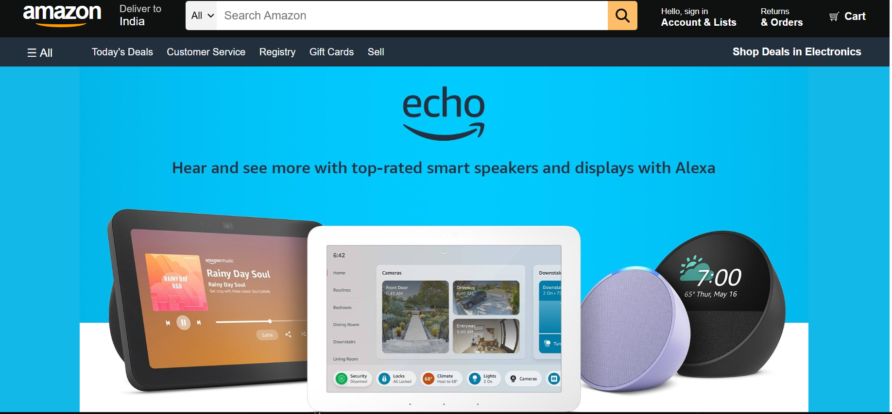
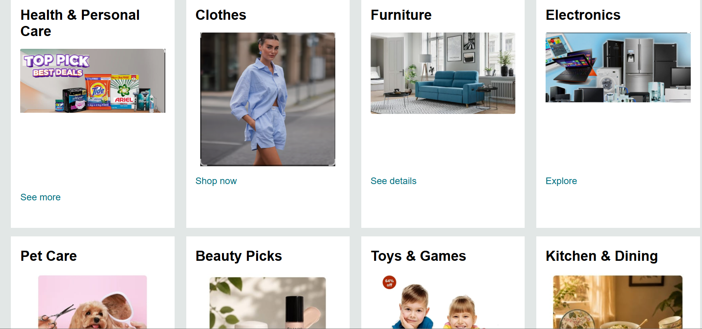

# 🛒 Amazon Clone

A responsive Amazon homepage clone built using HTML, CSS, and JavaScript.

## 🚀 Live Demo

🔗 https://amazon-clone-by-aditi.netlify.app/

## 📸 Preview

### Homepage



### Product section



---

## ✨ Features

- Responsive Amazon-style navigation bar
- Search bar with JavaScript functionality
- Hero banner
- Product category cards
- Interactive footer
- Clean Amazon-inspired UI

---

## 🛠️ Technologies Used

- HTML5
- CSS3
- JavaScript
- Font Awesome
- Git
- GitHub
- Netlify

---

## 📁 Project Structure

```
Amazon Clone
│
├── assets/
├── index.html
├── style.css
├── script.js
└── README.md
```

---

## 🎯 What I Learned

While building this project I learned:

- HTML page structure
- CSS Flexbox
- Responsive layouts
- JavaScript DOM manipulation
- Git & GitHub workflow
- Deploying websites with Netlify

---

## 👩‍💻 Author

**Aditi Bansal**

GitHub:
https://github.com/aditibansal-bit

Portfolio:
https://aditi-bansal-portfolio.netlify.app/

LinkedIn:
(Add your LinkedIn profile)

---

⭐ If you like this project, feel free to star the repository.